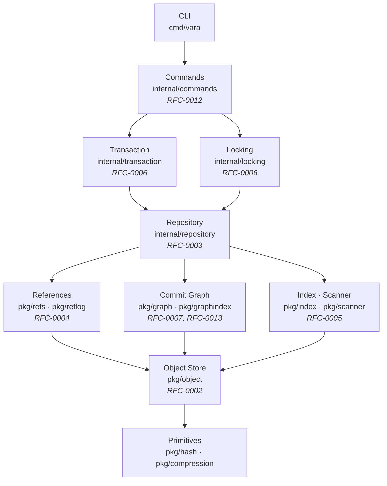

<div align="center">


<br />
<br />

# VARA

**An RFC-driven, transactional, content-addressed distributed version control engine written in Go.**

[](https://github.com/thulasiramk-2310/vara/actions/workflows/ci.yml)
[](https://go.dev)
[](LICENSE)
[](https://github.com/thulasiramk-2310/vara/releases/tag/v0.1.0-alpha)
[](docs/)

</div>

---

## Overview

VARA is a version control engine designed from first principles — not an extension of an existing system. Every component maps to a formal RFC specification, and every mutation goes through a write-ahead journal with atomic rename semantics.

**Why VARA instead of extending Git?**

Git's object model, wire protocol, and index format carry decades of backward-compatibility constraints that prevent clean architectural choices. VARA starts with the constraints that matter today: SHA-256 for collision resistance, zstd for throughput-first compression, a transactional storage layer that never silently corrupts, and a commit graph index that makes history traversal O(1) instead of O(N).

The local engine is feature-complete for v0.1. Remote protocol, replication, and an AI-assisted workflow layer are on the v0.2–v0.4 roadmap.

---

## Features

| Feature | Description |
|---------|-------------|
| **Immutable object store** | Every blob, tree, and commit is SHA-256 addressed. Content cannot change after storage. |
| **zstd compression** | All objects are compressed at rest. Faster than zlib at equivalent ratios. |
| **Write-ahead journal** | Six-phase transaction lifecycle. Crash at any point leaves the repository consistent. |
| **Hierarchical locking** | O_EXCL file locks acquired in a fixed order. Deadlock-free by construction (RFC-0006). |
| **Repository verification** | `vara verify` runs a seven-phase integrity report: objects → trees → commits → DAG → refs → index → journal. |
| **Three-way merge** | Myers O(ND) diff with diff3 line-level merge. Conflict markers for unresolvable regions. |
| **Three-layer undo** | Journal rollback → reflog restore → snapshot archive. Recovery always has a path forward. |
| **Commit Graph Index** | Binary `graph.idx` (RFC-0013). Warm history on 10,000 commits: **16 ms** (was 75.8 s without the index). |
| **Fuzz-tested parsers** | Ref names, journal entries, commit objects, tree blobs, and binary inputs all have fuzz corpora. |
| **ANSI color output** | Respects `NO_COLOR`, `TERM=dumb`, and `VARA_COLOR` override. Zero external dependencies. |
| **Cross-platform** | Tested on Linux, macOS, and Windows in CI. NTFS and case-insensitive filesystems handled. |
| **RFC-driven development** | Every package maps to one or more accepted RFCs. Architecture decisions are written in ADRs. |

---

## Architecture

VARA is built around a strict import hierarchy. Lower layers never import higher layers. Violating this invariant is a build error.



Cross-cutting packages (`pkg/diff`, `internal/merge`, `pkg/verify`, `pkg/snapshot`, `pkg/recovery`, `internal/undo`) operate within the same hierarchy — they import their layer and below, never above.

---

## Package Layout

```
vara/
├── cmd/
│   └── vara/               # CLI entry point — argument parsing and dispatch only
├── internal/
│   ├── commands/           # Command implementations (RFC-0012)
│   ├── locking/            # O_EXCL atomic file locks, exponential backoff (RFC-0006)
│   ├── merge/              # Three-way merge coordinator
│   ├── repository/         # Repository open/init, root structure (RFC-0003)
│   ├── status/             # Working tree status computation and formatting
│   ├── transaction/        # Write-ahead journal, six-phase lifecycle (RFC-0006)
│   └── undo/               # Three-layer undo decision tree (RFC-0009)
├── pkg/
│   ├── color/              # Zero-dependency ANSI color helper
│   ├── compression/        # zstd encode/decode wrappers
│   ├── diff/               # Myers O(ND) diff + diff3 three-way merge (RFC-0008)
│   ├── graph/              # Commit graph: BFS, LCA, generation numbers (RFC-0007)
│   ├── graphindex/         # Binary graph.idx: O(1) lookup, lazy rebuild (RFC-0013)
│   ├── hash/               # SHA-256 primitives and type aliases
│   ├── index/              # Staging area: binary format, serialization (RFC-0005)
│   ├── object/             # Blobs, trees, commits — content-addressed store (RFC-0002)
│   ├── recovery/           # Read-only inspection of journal, reflog, snapshots
│   ├── refs/               # References: atomic writes, name validation (RFC-0004)
│   ├── reflog/             # Reference history log (RFC-0004)
│   ├── scanner/            # Working tree scanner: fingerprint + content hash
│   ├── snapshot/           # .vara/snapshots/*.tar.zst archive creation (RFC-0009)
│   ├── types/              # Typed ID aliases: BlobID, TreeID, CommitID
│   └── verify/             # Seven-phase repository integrity checker
├── docs/
│   ├── ARCHITECTURE.md     # Layer map, data flows, key invariants — start here
│   ├── ADR/                # Architecture Decision Records
│   ├── COMPATIBILITY.md    # Stable vs internal API surfaces
│   └── VARA-RFC-*.md       # Formal RFC specifications
├── tests/
│   └── fuzz/               # Fuzz corpora for parsers and binary formats
└── benchmarks/
    └── commands/           # Go benchmarks for all user-facing commands
```

---

## Installation

**Build from source** (recommended for v0.1.0-alpha):

```sh
git clone https://github.com/thulasiramk-2310/vara
cd vara
go build -o vara ./cmd/vara
```

**Using `go install`:**

```sh
go install github.com/thulasiramk-2310/vara/cmd/vara@v0.1.0-alpha
```

**Verify the installation:**

```sh
vara --version
# 0.1.0-alpha
```

Requires **Go 1.21** or later. No CGO, no external build dependencies.

---

## Quick Start

```sh
# Initialize a new repository
vara init

# Stage files
vara add main.go               # single file
vara add src/                  # directory prefix
vara add .                     # everything

# Check working tree status
vara status

# Commit
vara commit -m "initial project structure"

# Create and switch branches
vara branch feature/auth
vara switch feature/auth

# View history
vara history
vara log                       # alias for history

# Three-layer undo (journal → reflog → snapshot)
vara undo

# Merge a branch
vara switch main
vara merge feature/auth

# Full repository integrity check
vara verify
```

**Getting help:**

```sh
vara --help                    # overview of all commands
vara help commit               # usage for a specific command
vara --version
```

---

## Example Workflow

Starting a project from scratch:

```sh
mkdir myproject && cd myproject

# Initialize
vara init
# Initialized empty VARA repository in myproject/.vara

# Create some files and stage them
echo 'package main' > main.go
echo '# My Project' > README.md
vara add .

# Commit the initial state
vara commit -m "initial project structure"
# [4f2a9c1] initial project structure

# Branch for a new feature
vara branch feature/api
vara switch feature/api
# Switched to branch 'feature/api'

# Do some work, stage, commit
echo 'func ServeHTTP() {}' >> main.go
vara add main.go
vara commit -m "add HTTP handler stub"
# [8c3b7d2] add HTTP handler stub

# Merge back
vara switch main
vara merge feature/api
# Merging 'feature/api' into 'main' (fast-forward)

# Inspect history
vara history
# commit 8c3b7d2a1b4c...
#     add HTTP handler stub
#
# commit 4f2a9c1e8f2a...
#     initial project structure

# Verify everything is healthy
vara verify
# Repository Integrity Report
# ─────────────────────────────────────
# Objects    ✔  4 verified
# Trees      ✔  2 verified
# Commits    ✔  2 verified
# DAG        ✔  No cycles
# Refs       ✔  2 valid
# Index      ✔  Consistent
# Result     Repository Healthy
```

---

## Performance

Measured on AMD Ryzen 9 8945HS, Windows 11, NTFS, Go 1.23.

| Command | Measured | Budget | Status |
|---------|----------|--------|--------|
| `vara init` | 2.8 ms | 20 ms | ✅ |
| `vara commit` | 15.4 ms | 200 ms | ✅ |
| `vara switch` | 220 ms | 500 ms | ✅ |
| `vara history` (10k commits, warm) | **16 ms** | 100 ms | ✅ |
| `vara history` (10k commits, cold) | ~1.1 s | — | index rebuild |
| `vara add` (1k files) | 787 ms | 500 ms | ⚠️ NTFS-bound |
| `vara status` (10k files) | 228 ms | 100 ms | ⚠️ NTFS-bound |

The `vara history` warm path uses the binary `graph.idx` (RFC-0013): one file read, in-memory BFS, no object store traversal. Cold path rebuilds the index and caches it for all subsequent calls.

The `vara add` and `vara status` overruns are filesystem-bound on NTFS; NTFS directory enumeration and `stat(2)` throughput are the limiting factors, not VARA's compute path.

---

## Documentation

| Document | Purpose |
|----------|---------|
| [`docs/ARCHITECTURE.md`](docs/ARCHITECTURE.md) | Layer map, commit flow, merge flow, transaction state machine, key invariants — start here |
| [`docs/VARA-RFC-0002-OBJECT-FORMAT.md`](docs/VARA-RFC-0002-OBJECT-FORMAT.md) | Object wire format, blob identity, serialization |
| [`docs/VARA-RFC-0003-REPOSITORY-LAYOUT.md`](docs/VARA-RFC-0003-REPOSITORY-LAYOUT.md) | `.vara/` directory structure |
| [`docs/VARA-RFC-0006-LOCKING.md`](docs/VARA-RFC-0006-LOCKING.md) | Lock ordering, transaction lifecycle, journal format |
| [`docs/VARA-RFC-0013-COMMIT-GRAPH-INDEX.md`](docs/VARA-RFC-0013-COMMIT-GRAPH-INDEX.md) | Binary `graph.idx` format, rebuild strategy, cost model |
| [`docs/ADR/`](docs/ADR/) | Architecture Decision Records (7 ADRs covering major design choices) |
| [`docs/COMPATIBILITY.md`](docs/COMPATIBILITY.md) | Which APIs are stable vs internal-only |
| [`CONTRIBUTING.md`](CONTRIBUTING.md) | Dev setup, architecture rules, commit format, what not to submit |

---

## RFC Index

| RFC | Title | Implementation |
|-----|-------|---------------|
| [0002](docs/VARA-RFC-0002-OBJECT-FORMAT.md) | Object Format | `pkg/object`, `pkg/hash`, `pkg/compression` |
| [0003](docs/VARA-RFC-0003-REPOSITORY-LAYOUT.md) | Repository Layout | `internal/repository` |
| [0004](docs/VARA-RFC-0004-REFERENCES.md) | References | `pkg/refs`, `pkg/reflog` |
| [0005](docs/VARA-RFC-0005-INDEX.md) | Index | `pkg/index`, `pkg/scanner` |
| [0006](docs/VARA-RFC-0006-LOCKING.md) | Locking & Transactions | `internal/locking`, `internal/transaction` |
| [0007](docs/VARA-RFC-0007-COMMIT-GRAPH.md) | Commit Graph | `pkg/graph` |
| [0008](docs/VARA-RFC-0008-MERGE-ALGORITHM.md) | Merge Algorithm | `pkg/diff`, `internal/merge` |
| [0009](docs/VARA-RFC-0009-UNDO-RECOVERY.md) | Undo & Recovery | `pkg/snapshot`, `pkg/recovery`, `internal/undo` |
| [0012](docs/VARA-RFC-0012-COMMAND-SPECIFICATION.md) | Command Specification | `internal/commands` |
| [0013](docs/VARA-RFC-0013-COMMIT-GRAPH-INDEX.md) | Commit Graph Index | `pkg/graphindex` |

---

## Current Status

**v0.1.0-alpha** — Local engine is feature-complete. This is an alpha release: APIs are not yet frozen, the wire format may change before v1.0.

### What is in v0.1.0-alpha

- All 10 user-facing commands: `init`, `add`, `status`, `commit`, `history`, `branch`, `switch`, `merge`, `undo`, `verify`
- Transactional writes with write-ahead journal and crash recovery
- Three-way merge with conflict markers
- Commit Graph Index (RFC-0013) — sub-20ms history on 10k commits
- Three-layer undo (journal rollback → reflog → snapshot)
- Repository verification across all components
- ANSI colored status output; `--help` and per-command help
- CI matrix: Ubuntu, Windows, macOS × Go 1.21, 1.22, 1.23
- Fuzz regression tests for all binary parsers

### What is not in v0.1.0-alpha

- Remote protocol (clone, push, pull, fetch) — RFC-0014 through RFC-0016, targeting v0.2
- Pack files / network delta compression
- Rebase, cherry-pick, stash, submodules
- AI workflow layer — v0.4 milestone
- Binary release artifacts — build from source for now

---

## Engineering Philosophy

**Correctness before optimization.** Every invariant is enforced at the API boundary. Wrong input fails explicitly; it never silently produces a corrupt repository state.

**Every package has a specification.** Code without a backing RFC is code that cannot be reviewed for correctness. If you cannot point to the spec, you cannot merge the change.

**Architecture is enforced, not documented.** The import hierarchy is a hard constraint, not a convention. A package that imports above its layer does not compile.

**The object format is permanent.** Once a blob, tree, or commit is written, its wire format is frozen. Repositories created with v0.1.0-alpha will be readable by any future VARA version.

**Recovery always has a path.** Three-layer undo (journal → reflog → snapshot) means there is no operation that permanently destroys local work. Every mutation is preceded by a snapshot; every snapshot is independent of the object store.

**Benchmarks are first-class tests.** Performance regressions are caught in CI alongside correctness regressions. A command that was fast last week must stay fast.

---

## Roadmap

| Version | Focus | Key Deliverables |
|---------|-------|-----------------|
| **v0.1** (now) | Local engine | All local commands, RFC-0013 graph index, `vara verify` |
| **v0.2** | Remote protocol | `vara clone`, `vara push`, `vara pull`, `vara fetch`, `vara remote` (RFC-0014–0016) |
| **v0.3** | Performance & scale | 100k-file stress tests, incremental graph index (RFC-0013v2), pack file format |
| **v0.4** | AI workflow layer | Provider-agnostic AI integration, semantic diff, automated conflict resolution |
| **v0.5** | VARA Hub alpha | Hosted repository service, pull request protocol, organization management |
| **v1.0** | Stable | Frozen wire format, frozen CLI, frozen remote protocol, LTS commitment |

---

## Testing

```sh
# All tests
go test ./...

# With race detector (Linux/macOS)
go test -race ./...

# Benchmarks (single run)
go test ./benchmarks/commands/ -bench=. -benchtime=1x -v

# Fuzz a specific parser (30 seconds)
go test ./tests/fuzz/ -fuzz=FuzzRefName -fuzztime=30s

# Fuzz regression only (CI mode)
go test ./tests/fuzz/ -run=FuzzRefName
```

---

## Contributing

Read [`CONTRIBUTING.md`](CONTRIBUTING.md) before opening a pull request. Key points:

- Every new package must reference one or more RFC numbers in its package comment.
- The import hierarchy (`commands → transaction → locking → repository → refs → graph → index → object → hash`) is enforced by convention and by CI import analysis.
- `object.BlobHash(content)` is the single authoritative way to compute a blob ID. Do not compute blob hashes manually.
- Do not add mock-based tests for anything that touches the object store or transaction layer. Use real repositories on a temp directory.
- Commit messages follow conventional commits: `feat:`, `fix:`, `test:`, `bench:`, `docs:`, `refactor:`.

---

## License

MIT — see [LICENSE](LICENSE).

Copyright (c) 2026 Thulasiram K
