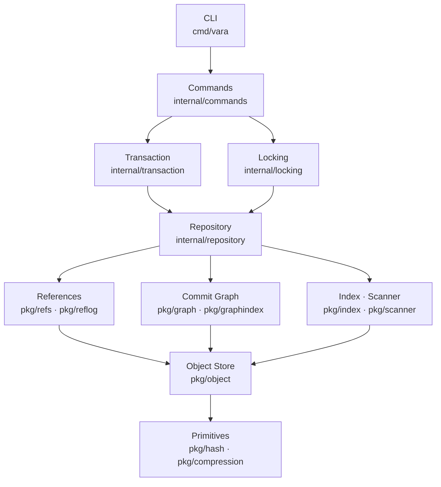

<div align="center">



<br />
<br />

# VARA

**RFC-driven, transactional, content-addressed version control engine written in Go.**

[](https://github.com/thulasiramk-2310/vara/actions/workflows/ci.yml)
[](https://go.dev)
[](LICENSE)
[](https://github.com/thulasiramk-2310/vara/releases/tag/v0.1.0-alpha)
[](docs/)

</div>

---

## Why VARA?

In archaic usage, a *vara* is a measuring rod — a fixed reference from which all distances are taken. In VARA, every object is identified by its SHA-256 content hash: an immutable measure. Every repository state is a precise point relative to that measure.

VARA is built around a protocol-first architecture: SHA-256 object identity, zstd compression, transactional repository operations, and a commit graph index that makes history traversal O(1). The local engine is feature-complete in v0.1. Remote protocol, replication, and an AI-assisted workflow layer follow in subsequent releases.

---

## Features

| Feature | Details |
|---------|---------|
| **Immutable object store** | SHA-256 addressed blobs, trees, and commits. Content cannot change after storage. |
| **zstd compression** | All objects are compressed at rest. Faster than zlib at equivalent ratios. |
| **Write-ahead journal** | Six-phase transaction lifecycle. Crash at any point leaves the repository consistent. |
| **Hierarchical locking** | O_EXCL file locks acquired in fixed order. Deadlock-free by construction (RFC-0006). |
| **Repository verification** | Seven-phase integrity report: objects → trees → commits → DAG → refs → index → journal. |
| **Three-way merge** | Myers O(ND) diff, diff3 line-level merge, conflict markers for unresolvable regions. |
| **Three-layer undo** | Journal rollback → reflog restore → snapshot archive. Always a path to recovery. |
| **Commit Graph Index** | Binary `graph.idx` (RFC-0013). History on 10k commits: **16 ms** (was 75.8 s). |
| **Fuzz-tested parsers** | Ref names, journal entries, commit objects, tree blobs, and binary inputs. |
| **Cross-platform** | Tested on Linux, macOS, and Windows in CI across Go 1.21, 1.22, 1.23. |

---

## Architecture

Strict layered hierarchy. Lower layers never import higher layers.



Every package maps to one or more RFC specifications. See [`docs/ARCHITECTURE.md`](docs/ARCHITECTURE.md) for data flow diagrams, transaction state machine, and key invariants.

---

## Installation

```sh
git clone https://github.com/thulasiramk-2310/vara
cd vara
go build -o vara ./cmd/vara
./vara --version
# 0.1.0-alpha
```

Or with `go install`:

```sh
go install github.com/thulasiramk-2310/vara/cmd/vara@v0.1.0-alpha
```

Requires **Go 1.21+**. No CGO, no external build dependencies.

---

## Quick Start

```sh
vara init
vara add .
vara commit -m "initial commit"

vara branch feature
vara switch feature
vara commit -m "add feature"

vara switch main
vara merge feature

vara history          # sub-20ms on 10k commits via graph index
vara verify           # full integrity check
vara undo             # three-layer recovery: journal → reflog → snapshot
```

**Working with remotes** (RFC-0014, local transport):

```sh
vara clone ../upstream myrepo   # copy a repository and its history
vara remote add origin ../up    # register a remote
vara fetch origin               # update remote-tracking refs
vara pull origin main           # fetch + fast-forward or three-way merge
vara push origin main           # upload commits (fast-forward checked)
```

**`vara status`:**

```
On branch main

Changes staged for commit:

    modified:   src/engine.go

Untracked files:

    config.yaml
```

**`vara verify`:**

```
Repository Integrity Report
─────────────────────────────
Objects    ✔  4 verified
Trees      ✔  2 verified
Commits    ✔  2 verified
DAG        ✔  No cycles
Refs       ✔  2 valid
Index      ✔  Consistent
Result     Repository Healthy
```

---

## Performance

Measured on AMD Ryzen 9 8945HS, Windows 11, NTFS, Go 1.23.

| Command | Measured | Budget |
|---------|----------|--------|
| `vara init` | 2.8 ms | 20 ms ✅ |
| `vara commit` | 15.4 ms | 200 ms ✅ |
| `vara switch` | 220 ms | 500 ms ✅ |
| `vara history` (10k commits, warm) | **16 ms** | 100 ms ✅ |
| `vara add` (1k files) | 787 ms | 500 ms ⚠️ NTFS-bound |

The `vara history` warm path reads `graph.idx` directly — one file read, in-memory BFS, no object store traversal. Cold path rebuilds the index and caches it for all subsequent calls.

---

## Current Status

**v0.1.0-alpha** — local engine complete, remote protocol not yet started.

| Component | Status |
|-----------|--------|
| Local repository engine | ✅ Complete |
| Transactional storage with crash recovery | ✅ Complete |
| Three-way merge and conflict detection | ✅ Complete |
| Commit Graph Index (RFC-0013) | ✅ Complete |
| Repository verification (`vara verify`) | ✅ Complete |
| Three-layer undo (`vara undo`) | ✅ Complete |
| Remote protocol — clone, fetch, pull, push (local transport, RFC-0014) | ✅ Complete |
| Network transport (`vara serve`, `vara://`) | 🚧 v0.3 |
| Pack file format and delta compression | 🚧 v0.3 |
| AI workflow layer | 🚧 v0.4 |
| Binary release artifacts | 🚧 Soon |

---

## Roadmap

| Version | Milestone |
|---------|-----------|
| **v0.1** (now) | Local engine — all local commands, RFC-0013, `vara verify` |
| **v0.2** | Remote protocol — clone, fetch, pull, push over local transport (RFC-0014) ✅ |
| **v0.3** | Network transport + scale — `vara serve`, delta packs, 100k-file stress tests (RFC-0015/0016) |
| **v0.4** | AI layer — semantic diff, automated conflict resolution |
| **v0.5** | VARA Hub alpha — hosted repositories, pull request protocol |
| **v1.0** | Stable — frozen wire format, frozen CLI, LTS commitment |

---

## Documentation

| Document | Description |
|----------|-------------|
| [`docs/ARCHITECTURE.md`](docs/ARCHITECTURE.md) | Layer map, data flows, invariants — start here |
| [`docs/VARA-RFC-*.md`](docs/) | Formal RFC specifications (10 accepted) |
| [`docs/ADR/`](docs/ADR/) | Architecture Decision Records |
| [`docs/COMPATIBILITY.md`](docs/COMPATIBILITY.md) | Stable vs internal API surfaces |
| [`CONTRIBUTING.md`](CONTRIBUTING.md) | Dev setup, architecture rules, commit format |

---

## Contributing

See [`CONTRIBUTING.md`](CONTRIBUTING.md). Key constraints:

- Every new package must reference its RFC in the package comment.
- The import hierarchy is a hard constraint. A package that imports above its layer does not compile.
- `object.BlobHash(content)` is the single authoritative blob ID function — never compute manually.
- Use real repository temp directories in tests; do not mock the object store.

---

## License

MIT — see [LICENSE](LICENSE).
